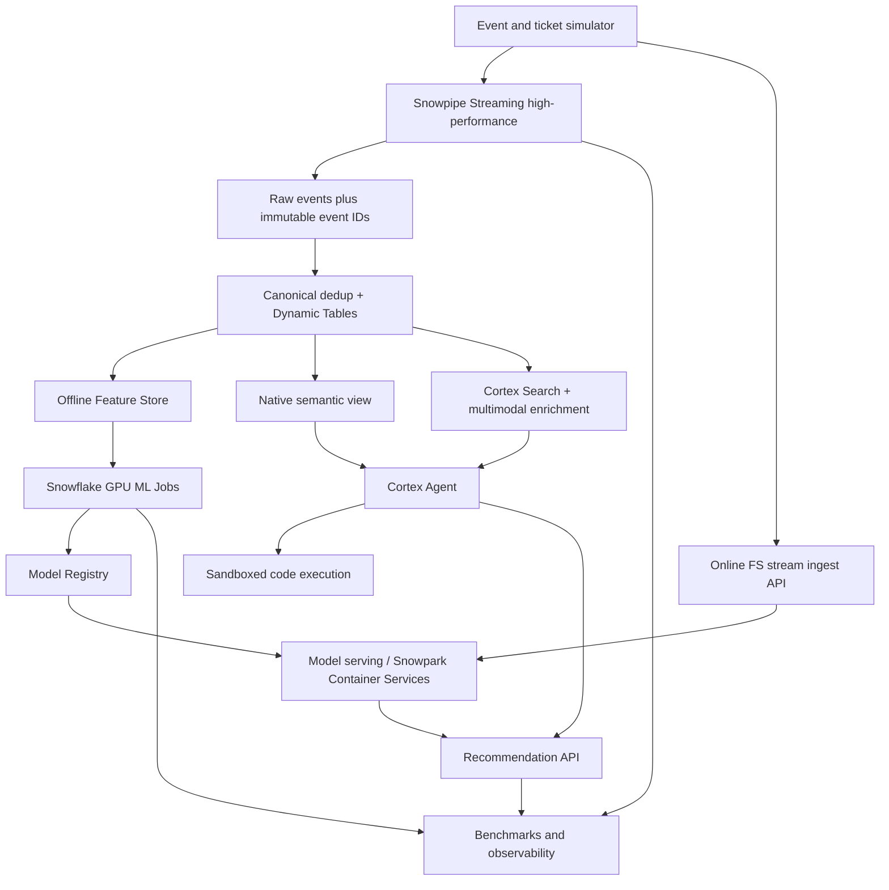

# Snowflake X-LAB reference architecture

## Data correctness and boundaries

Canonical event ID = (`tenant_id`, `event_id`), not Kafka offset. Source offsets are checkpointed only after Snowpipe commit confirmation. Do not drop late data without a defined watermark policy. Compare as-of point-in-time training features and versioned serving features; train/serve skew is a test failure.

Online Feature Store stream ingestion is **not** automatically equivalent to the Snowpipe Streaming SQL path. The two have distinct transports, semantics, latencies and pricing. Run them as parallel experimental arms before proposing a unified architecture.

Cortex Search indexes metadata and text; a hybrid search service is not a generic GPU vector-index benchmark. Multimodal processing requires separately staged assets, consent/licensing and model/region checks.

Every production tenant boundary must be protected in storage/query privileges and trusted API authorization; a model instruction is never a security boundary. Sandbox code execution has separate rights and does not implicitly read SQL itself.
